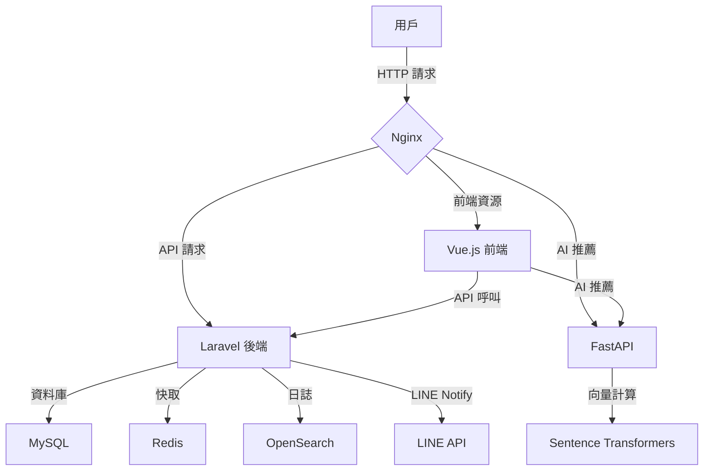

# SaaSumi - 民宿管理 SaaS 平台

**SaaSumi：多租戶民宿管理平台，整合 AI 房型推薦、LINE Notify 通知與日語在地化。**  
**雲端民宿管理，智能推薦未來**

SaaSumi 是一個模組化的多租戶民宿管理 SaaS，專為日本市場設計，結合 Laravel 後端、FastAPI AI 推薦引擎與 Vue.js 前端，提供高效的民宿管理解決方案。本儲存庫僅包含核心代碼，展示多租戶架構、AI 推薦、LINE Notify 整合與日語介面的實現邏輯，適用於技術展示與面試用途。

---

## 專案亮點

1. **多租戶架構**：
   - 使用 `stancl/tenancy` 實現租戶資料隔離，每個民宿業者有獨立資料庫與設定。
   - 透過 `X-Tenant-Domain` 頭部（例如 `tokyo-inn.localhost`）動態識別租戶。
   - 支援租戶管理員登錄與資訊顯示，提升可擴展性。

2. **AI 房型推薦**：
   - FastAPI 搭配 `sentence-transformers`（`multilingual-e5-large`）實現日文關鍵詞搜尋與房型推薦。
   - 返回房型名稱、描述、圖片與相似度分數，增強住客體驗。

3. **LINE Notify 整合**：
   - 提供 OAuth 授權與租戶特定的 LINE Notify 令牌管理。
   - 支援發送通知（`/api/line-notify/send-message`）與解除綁定（`/api/line-notify/revoke`），符合日本市場需求。

4. **日語在地化**：
   - Vue.js 前端支援全日語介面，包含金額（`¥2,500,000`）與日期（`2025年6月27日`）格式化。
   - 儀表板顯示動態 KPI（預約數、收益）與趨勢圖表，提升用戶體驗。

5. **模組化設計**：
   - 後端採用 Laravel 模組化結構，前端使用 Vue.js 組件化，易於維護與擴展。
   - 支援 Docker Compose 與 GitHub Actions（概念性展示），確保部署效率。

---

## 系統架構

以下為 SaaSumi 的系統架構圖，展示各服務間的互動關係：



- **Nginx**：反向代理，解析租戶域名（`*.localhost`）並傳遞 `X-Tenant-Domain`。
- **Laravel 後端**：處理租戶管理、住客 CRUD、KPI 計算與 LINE Notify 整合。
- **FastAPI**：提供 AI 房型推薦，基於日文關鍵詞與向量相似性。
- **Vue.js 前端**：日語介面，展示儀表板、住客管理與推薦結果。
- **MySQL/Redis**：支援資料儲存與快取，實現多租戶隔離。
- **OpenSearch**：日誌儲存（占位實現）。

---

## 技術棧

- **後端**：Laravel 10（PHP 8.1）、`stancl/tenancy`（多租戶）、Sanctum（認證）
- **AI 推薦**：FastAPI、Sentence Transformers（`multilingual-e5-large`）
- **前端**：Vue.js 3、Tailwind CSS、Chart.js
- **基礎設施**：Docker Compose、Nginx、MySQL、Redis、OpenSearch
- **CI/CD**：GitHub Actions（概念性設計）

---

## 關鍵代碼片段

以下挑選三段核心代碼，展示專案的技術實現邏輯，加註解以解釋功能。

### 1. Laravel 住客管理（`backend/app/Http/Controllers/GuestController.php`）

```php
<?php
namespace App\Http\Controllers;

use App\Models\Guest;
use Illuminate\Http\Request;
use Stancl\Tenancy\Database\Concerns\BelongsToTenant;

class GuestController extends Controller
{
    // 查詢住客列表，支援搜尋與排序
    public function index(Request $request)
    {
        $query = $request->input('query'); // 搜尋關鍵詞
        $sortBy = $request->input('sortBy', 'created_at'); // 排序欄位
        $sortDirection = $request->input('sortDirection', 'desc'); // 排序方向

        $guests = Guest::query()
            ->when($query, function ($q) use ($query) {
                // 搜尋姓名或 Email
                return $q->where('name', 'like', "%{$query}%")
                         ->orWhere('email', 'like', "%{$query}%");
            })
            ->orderBy($sortBy, $sortDirection)
            ->get();

        return response()->json($guests);
    }

    // 新增住客
    public function store(Request $request)
    {
        $validated = $request->validate([
            'name' => 'required|string|max:255',
            'email' => 'required|email|unique:guests,email',
            'phone' => 'nullable|string|max:20',
        ]);

        $guest = Guest::create($validated); // 自動綁定租戶 ID
        return response()->json($guest, 201);
    }
}
```

**註解說明**：
- 使用 `stancl/tenancy` 的 `BelongsToTenant` 確保住客資料綁定租戶。
- `index` 方法支援動態搜尋（姓名、Email）與排序，提升靈活性。
- `store` 方法包含輸入驗證，確保資料完整性。

### 2. FastAPI AI 推薦（`fastapi-recommend/main.py`）

```python
from fastapi import FastAPI, HTTPException
from sentence_transformers import SentenceTransformer, util
from typing import List, Dict
import logging

app = FastAPI()
model = SentenceTransformer('intfloat/multilingual-e5-large', cache_folder='./model_cache')
sample_rooms = [...] # 模擬房型資料

# AI 房型推薦端點
@app.get("/api/recommend")
async def recommend(keywords: str, limit: int = 3) -> List[Dict]:
    try:
        # 計算關鍵詞嵌入向量
        query_embedding = model.encode(keywords, convert_to_tensor=True)
        room_embeddings = model.encode(
            [room['description'] for room in sample_rooms],
            convert_to_tensor=True
        )
        # 計算餘弦相似度
        similarities = util.cos_sim(query_embedding, room_embeddings)[0]
        # 按相似度排序並返回前 N 個結果
        top_indices = similarities.argsort(descending=True)[:limit]
        results = [
            {
                'id': sample_rooms[i]['id'],
                'name': sample_rooms[i]['name'],
                'description': sample_rooms[i]['description'],
                'image_url': sample_rooms[i]['image_url'],
                'score': float(similarities[i]),
                'explanation': f'與「{keywords}」高度相關'
            } for i in top_indices
        ]
        return results
    except Exception as e:
        logging.error(f"推薦錯誤: {str(e)}")
        raise HTTPException(status_code=500, detail="推薦服務錯誤")
```

**註解說明**：
- 使用 `sentence-transformers` 計算日文關鍵詞與房型描述的向量相似度。
- 支援動態關鍵詞查詢，返回房型資料與相似度分數。
- 包含錯誤處理與日誌記錄，確保服務穩定性。

### 3. Vue.js 儀表板（`frontend/index.html` 內 `Dashboard` 組件）

```html
<script>
Vue.component('Dashboard', {
  data() {
    return {
      kpis: { bookings: 0, revenue: 0, rating: 0, newGuests: 0, trends: [] }
    };
  },
  methods: {
    // 取得 KPI 資料
    async fetchKPIs() {
      try {
        const response = await fetchApi('/api/dashboard/kpis');
        this.kpis = response.data;
        this.renderChart(); // 繪製趨勢圖表
      } catch (error) {
        showModal('錯誤', '無法取得 KPI 資料，請稍後重試。');
      }
    },
    // 格式化貨幣為日幣
    formatCurrency(value) {
      return `¥${value.toLocaleString('ja-JP')}`;
    },
    // 繪製收益趨勢圖表
    renderChart() {
      const ctx = this.$refs.chart.getContext('2d');
      new Chart(ctx, {
        type: 'line',
        data: {
          labels: this.kpis.trends.map(t => this.formatDate(t.date)),
          datasets: [{
            label: '收益趨勢',
            data: this.kpis.trends.map(t => t.revenue),
            borderColor: '#4B0082'
          }]
        },
        options: { scales: { y: { beginAtZero: true } } }
      });
    },
    // 格式化日期為日式格式
    formatDate(date) {
      return new Date(date).toLocaleDateString('ja-JP', {
        year: 'numeric',
        month: 'long',
        day: 'numeric'
      });
    }
  },
  mounted() { this.fetchKPIs(); },
  template: `
    <div>
      <h2>ダッシュボード</h2>
      <div class="kpi-grid">
        <div>預約數: {{ kpis.bookings }}</div>
        <div>總收益: {{ formatCurrency(kpis.revenue) }}</div>
        <div>平均評價: {{ kpis.rating }}</div>
        <div>新增住客: {{ kpis.newGuests }}</div>
      </div>
      <canvas ref="chart"></canvas>
    </div>
  `
});
</script>
```

**註解說明**：
- 使用 Vue.js 3 組件化設計，展示動態 KPI 與趨勢圖表。
- `formatCurrency` 和 `formatDate` 實現日幣與日式日期格式化，符合日本市場需求。
- 錯誤處理使用自訂模態框，確保友好的日語提示。

---

## 安裝與運行

**注意**：本儲存庫僅包含核心代碼（Laravel 控制器、FastAPI 推薦邏輯、Vue.js 前端組件），用於技術展示與面試用途，無完整的 Laravel 專案結構。若需運行完整應用，需自行搭建 Laravel 環境並整合核心代碼。以下為運行指引：

### 環境要求
- **PHP 8.1**：用於 Laravel 後端。
- **Python 3.11**：用於 FastAPI AI 推薦服務。
- **Node.js**：用於 Vue.js 前端（若需建置）。
- **Docker**（可選）：用於模擬完整環境。
- **依賴套件**：
  - Laravel：`stancl/tenancy`、`laravel/sanctum`
  - FastAPI：`fastapi`、`sentence-transformers`
  - Vue.js：`vue@3`、`tailwindcss`、`chart.js`

### 運行步驟
1. **檢視核心代碼**：
   - 後端：`backend/app/Http/Controllers/GuestController.php`（住客管理邏輯）。
   - AI 推薦：`fastapi-recommend/main.py`（房型推薦端點）。
   - 前端：`frontend/index.html`（Vue.js 儀表板與組件）。
   - 代碼展示多租戶、AI 推薦與日語介面的實現邏輯。

2. **搭建 Laravel 環境（若需運行）**：
   - 初始化一個新 Laravel 專案：
     ```bash
     composer create-project laravel/laravel SaaSumi-backend
     cd SaaSumi-backend
     ```
   - 安裝依賴：
     ```bash
     composer require stancl/tenancy laravel/sanctum
     ```
   - 複製本儲存庫的 `GuestController.php` 至 `app/Http/Controllers/`。
   - 配置 `config/tenancy.php` 與 `routes/api.php`，啟用多租戶中間件：
     ```php
     Route::middleware(['api', 'tenancy'])->group(function () {
         Route::apiResource('guests', GuestController::class);
     });
     ```
   - 運行遷移與種子資料：
     ```bash
     php artisan migrate
     php artisan tenant:create tokyo-inn
     ```

3. **運行 FastAPI AI 推薦服務**：
   - 複製 `fastapi-recommend/main.py` 至本地目錄。
   - 安裝依賴：
     ```bash
     pip install fastapi uvicorn sentence-transformers
     ```
   - 啟動服務：
     ```bash
     uvicorn main:app --host 0.0.0.0 --port 8001
     ```
   - 測試端點：`http://localhost:8001/api/recommend?keywords=溫泉&limit=3`

4. **運行前端**：
   - 將 `frontend/index.html` 部署至靜態伺服器（例如 Nginx 或 `http-server`）。
   - 安裝 Node.js 依賴（若需建置）：
     ```bash
     npm install vue@3 tailwindcss chart.js
     ```
   - 啟動開發伺服器：
     ```bash
     npx http-server frontend -p 8080
     ```
   - 訪問：`http://localhost:8080`

5. **Docker 模擬完整環境（可選）**：
   - 若需完整環境，參考以下 `docker-compose.yml` 範例：
     ```yaml
     version: '3'
     services:
       backend:
         image: php:8.1-fpm
         volumes:
           - ./backend:/var/www
         ports:
           - "8000:80"
       fastapi:
         image: python:3.11-slim
         volumes:
           - ./fastapi-recommend:/app
         ports:
           - "8001:8001"
       frontend:
         image: nginx:latest
         volumes:
           - ./frontend:/usr/share/nginx/html
         ports:
           - "8080:80"
       mysql:
         image: mysql:8.0
         environment:
           - MYSQL_ROOT_PASSWORD=root
     ```
   - 啟動：`docker compose up -d`

### 注意事項
- 本儲存庫僅提供核心代碼，需自行配置完整的 Laravel 專案（`composer.json`、`vendor/` 等）。
- FastAPI 的模型會緩存至 `model_cache` 目錄。
- 前端需設置正確的 API 位址（`fetchApi` 函數中的 `apiUrl`）。
- 測試多租戶功能需配置本地 hosts：`127.0.0.1 tokyo-inn.localhost`。

---

## 聯繫方式

- **作者**：BpsEason
- **GitHub**：https://github.com/BpsEason
- **Email**：bps.eason@example.com（請自行替換）

歡迎提供反饋或技術討論！若有問題，請開 Issue 或聯繫我。
